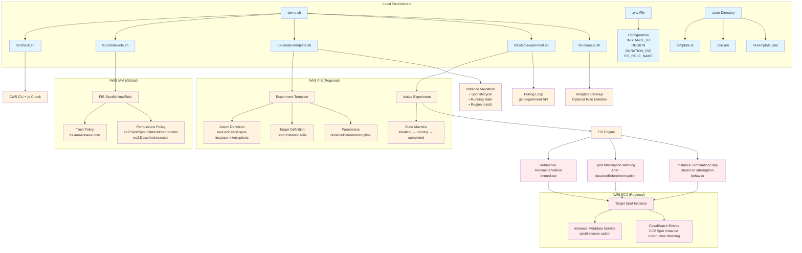

# Spot Interrupt

Send a **real Spot interruption** to a specific Spot instance using **AWS FIS**.

## Requirements
- AWS CLI v2 (configured; `aws sts get-caller-identity` works)
- jq

## Quick start (single command)
```bash
# Edit .env first (INSTANCE_ID, REGION). Then:
./demo.sh up && ./demo.sh run && ./demo.sh down
```

## Demo Output Example

```bash
$ ./demo.sh up
Checking prerequisites...
✓ AWS CLI + jq OK; region=us-west-1
✓ Using existing role: arn:aws:iam::314123422413:role/FIS-SpotMinimalRole

$ ./demo.sh run
Creating one-off FIS template targeting i-05691389103d0a0b6 (ARN: arn:aws:ec2:us-west-1:314123422413:instance/i-05691389103d0a0b6) with lead time PT2M
✓ Template: EXTC1dQgmMGzyC6jr
Starting experiment from template EXTC1dQgmMGzyC6jr ...
✓ Experiment EXP4m4cgqwJoiu3Tmt started (state: initiating at 2025-08-17T21:09:54.728000+05:30)
Polling until experiment completes/failed/stopped...
  - running (Experiment is running.)
  - completed (Experiment completed.)
✓ SUCCESS: Interruption signal delivered; experiment is completed.
Deleting template EXTC1dQgmMGzyC6jr ...
✓ Template deleted

$ ./demo.sh down
No template to delete
Role retained (set DELETE_ROLE_ON_DOWN=true to remove)
```

## Architecture Diagram



### Architecture Components

#### 1. **Local Scripts & State Management**
- **`demo.sh`**: Main orchestrator script with `up`, `run`, `down` commands
- **`.env`**: Configuration file containing target instance ID, region, and timing parameters
- **`.state/`**: Local state directory tracking template IDs, role ARNs, and generated templates

#### 2. **AWS IAM (Global)**
- **FIS Role**: Minimal IAM role with trust policy allowing `fis.amazonaws.com` to assume it
- **Permissions**: Only `ec2:SendSpotInstanceInterruptions` and `ec2:DescribeInstances`

#### 3. **AWS FIS (Regional)**
- **Experiment Template**: JSON definition specifying the target instance and interruption parameters
- **Action**: `aws:ec2:send-spot-instance-interruptions` with configurable lead time
- **Experiment Execution**: State machine progressing through initiating → running → completed

#### 4. **AWS EC2 (Regional)**
- **Target Instance**: Must be a Spot instance in running state
- **Interruption Sequence**: 
  1. Immediate rebalance recommendation
  2. Spot interruption warning (after `durationBeforeInterruption`)
  3. Instance termination/stop (based on interruption behavior)

#### 5. **Workflow Phases**

1. **Setup Phase** (`./demo.sh up`):
   - Validate dependencies (AWS CLI, jq)
   - Create/reuse IAM role with minimal FIS permissions
   - Save role ARN to local state

2. **Execution Phase** (`./demo.sh run`):
   - Validate target instance (Spot, running, correct region)
   - Create FIS experiment template
   - Start experiment and poll until completion
   - Clean up template automatically

3. **Cleanup Phase** (`./demo.sh down`):
   - Remove any remaining templates
   - Optionally delete IAM role (if `DELETE_ROLE_ON_DOWN=true`)

#### 6. **Safety Features**
- Single-use templates (created and deleted per experiment)
- Minimal IAM permissions (no CloudFormation, EventBridge, or Lambda)
- Instance validation before execution
- State tracking for reliable cleanup

## Typical workflow

```bash
# 1) Check deps + create minimal FIS role
./demo.sh up

# 2) Create a one-off template + start experiment (sends warning then interrupts)
./demo.sh run

# 3) Clean everything (template + optional role)
./demo.sh down
```

## Configuration

Copy and edit:

```bash
cp .env.example .env
```

Key variables:

* `REGION` – AWS region (e.g., `us-east-1`)
* `INSTANCE_ID` – **Spot** instance ID to interrupt (e.g., `i-0123456789abcdef0`)
* `DURATION_ISO` – Warning lead time (ISO 8601, `PT2M`..`PT15M`)
* `FIS_ROLE_NAME` – IAM role name used by FIS (default `FIS-SpotMinimalRole`)
* `DELETE_ROLE_ON_DOWN` – Set `true` to delete role during `down`

## What happens to the instance?

* FIS sends a **rebalance recommendation** immediately, then a **Spot interruption warning** with your `DURATION_ISO` lead time, and finally interrupts (terminate/stop depending on the instance's interruption behavior).

> Note: The instance must be **Spot** and **running**. On completion, you stop being billed for the instance; attached EBS may still incur cost if left around.

## Safety

* No CloudFormation. No EventBridge/Lambda. Minimal IAM.
* Creates a **single** experiment template, then deletes it.
