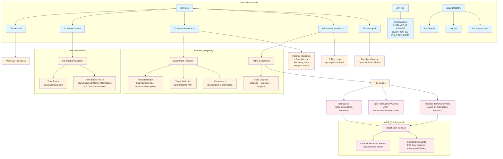

# Spot Interrupt

Send a **real Spot interruption** or **rebalance recommendation** to a specific Spot instance using **AWS FIS**.

## Features

- ✅ **Spot Instance Interruption**: Send interruption signals with configurable lead time
- ⚠️ **Rebalance Recommendations**: Available in supported regions (not available in us-west-1)
- 🕒 **Enhanced Logging**: India timezone timestamps with elapsed time tracking
- 📊 **Real-time Monitoring**: Polling with detailed status updates
- 🛡️ **Safety**: Single-use templates with automatic cleanup

## Requirements
- AWS CLI v2 (configured; `aws sts get-caller-identity` works)
- jq

## Quick start

### Basic spot interruption
```bash
# Edit .env first (INSTANCE_ID, REGION). Then:
./demo.sh up && ./demo.sh run && ./demo.sh down
```

### Rebalance recommendation (region-dependent)
```bash
# Check if rebalance is available in your region first
./demo.sh up && ./demo.sh rebalance i-1234567890abcdef0 && ./demo.sh down
```

## Commands

```bash
./demo.sh up                    # Setup: deps + create minimal IAM role
./demo.sh run [INSTANCE_ID]     # Send spot interruption (with lead time)
./demo.sh rebalance [INSTANCE_ID] # Send rebalance recommendation only
./demo.sh down                  # Cleanup: delete templates (+ optional role)
```

## Configuration

Edit `.env` file:
```bash
REGION=us-west-1
INSTANCE_ID=i-1234567890abcdef0
DURATION_ISO=PT2M               # Lead time before interruption
REBALANCE_ONLY=false           # Set to true for rebalance-only mode
```

## Demo Output Example

```bash
$ ./demo.sh up
[2025-08-23 02:04:09 IST] === SETUP PHASE ===
[2025-08-23 02:04:09 IST] Checking prerequisites...
[2025-08-23 02:04:10 IST] ✓ AWS CLI + jq OK; region=us-west-1
[2025-08-23 02:04:11 IST] ✓ Using existing role: arn:aws:iam::314123422413:role/FIS-SpotMinimalRole
[2025-08-23 02:04:11 IST] ✓ Setup completed successfully

$ ./demo.sh run i-09c6d29d3eec24ba8
[2025-08-23 02:04:26 IST] === EXPERIMENT PHASE ===
[2025-08-23 02:04:26 IST] Mode: SPOT INTERRUPTION (duration: PT2M)
[2025-08-23 02:04:26 IST] Target instance: i-09c6d29d3eec24ba8
[2025-08-23 02:04:31 IST] Creating FIS template for SPOT INTERRUPTION targeting i-09c6d29d3eec24ba8 (ARN: arn:aws:ec2:us-west-1:314123422413:instance/i-09c6d29d3eec24ba8) with lead time PT2M
[2025-08-23 02:04:32 IST] ✓ Template: EXTDHS7Lzz29sSriC
[2025-08-23 02:04:33 IST] Starting experiment from template EXTDHS7Lzz29sSriC ...
[2025-08-23 02:04:34 IST] ✓ Experiment EXPy63drK9cS4nKcNN started (state: initiating at 2025-08-23T02:04:34.601000+05:30)
[2025-08-23 02:04:34 IST] Polling until experiment completes/failed/stopped...
  [2025-08-23 02:04:44 IST] Poll #1 (10s elapsed) - running (Experiment is running.)
  [2025-08-23 02:04:54 IST] Poll #2 (20s elapsed) - running (Experiment is running.)
  [2025-08-23 02:06:34 IST] Poll #12 (2m 0s elapsed) - completed (Experiment completed.)
[2025-08-23 02:06:34 IST] ✓ SUCCESS: Experiment completed in 2m 0s
[2025-08-23 02:06:35 IST] ✓ Experiment phase completed in 2m 9s

$ ./demo.sh down
[2025-08-23 02:06:40 IST] === CLEANUP PHASE ===
[2025-08-23 02:06:41 IST] Deleting template EXTDHS7Lzz29sSriC ...
[2025-08-23 02:06:42 IST] ✓ Template deleted
[2025-08-23 02:06:42 IST] Role retained (set DELETE_ROLE_ON_DOWN=true to remove)
[2025-08-23 02:06:42 IST] ✓ Cleanup completed
```

## Regional Availability

| Feature | us-west-1 | us-east-1 | eu-west-1 | Status |
|---------|-----------|-----------|-----------|---------|
| Spot Interruption | ✅ Available | ✅ Available | ✅ Available | Widely supported |
| Rebalance Recommendation | ❌ Not Available | ✅ Available | ✅ Available | Limited regions |

> **Note**: Rebalance recommendations are not available in all regions. Check your region's FIS action availability before using the rebalance feature.

## Architecture Diagram



### Architecture Components

#### 1. **Local Scripts & State Management**
- **`demo.sh`**: Main orchestrator script with `up`, `run`, `down` commands
- **`.env`**: Configuration file containing target instance ID, region, and timing parameters
- **`.state/`**: Local state directory tracking template IDs, role ARNs, and generated templates

#### 2. **AWS IAM (Global)**
- **FIS Role**: Minimal IAM role with trust policy allowing `fis.amazonaws.com` to assume it
- **Permissions**: Only `ec2:SendSpotInstanceInterruptions` and `ec2:DescribeInstances`

#### 3. **AWS FIS (Regional)**
- **Experiment Template**: JSON definition specifying the target instance and interruption parameters
- **Action**: `aws:ec2:send-spot-instance-interruptions` with configurable lead time
- **Experiment Execution**: State machine progressing through initiating → running → completed

#### 4. **AWS EC2 (Regional)**
- **Target Instance**: Must be a Spot instance in running state
- **Interruption Sequence**: 
  1. Immediate rebalance recommendation
  2. Spot interruption warning (after `durationBeforeInterruption`)
  3. Instance termination/stop (based on interruption behavior)

#### 5. **Workflow Phases**

1. **Setup Phase** (`./demo.sh up`):
   - Validate dependencies (AWS CLI, jq)
   - Create/reuse IAM role with minimal FIS permissions
   - Save role ARN to local state

2. **Execution Phase** (`./demo.sh run`):
   - Validate target instance (Spot, running, correct region)
   - Create FIS experiment template
   - Start experiment and poll until completion
   - Clean up template automatically

3. **Cleanup Phase** (`./demo.sh down`):
   - Remove any remaining templates
   - Optionally delete IAM role (if `DELETE_ROLE_ON_DOWN=true`)

#### 6. **Safety Features**
- Single-use templates (created and deleted per experiment)
- Minimal IAM permissions (no CloudFormation, EventBridge, or Lambda)
- Instance validation before execution
- State tracking for reliable cleanup

## Typical workflow

```bash
# 1) Check deps + create minimal FIS role
./demo.sh up

# 2a) Send spot interruption (sends warning then interrupts after lead time)
./demo.sh run i-1234567890abcdef0

# 2b) OR send rebalance recommendation only (immediate, no interruption)
./demo.sh rebalance i-1234567890abcdef0

# 3) Clean everything (template + optional role)
./demo.sh down
```

## Configuration

Copy and edit:

```bash
cp .env.example .env
```

Key variables:

* `REGION` – AWS region (e.g., `us-east-1`)
* `INSTANCE_ID` – **Spot** instance ID to target (e.g., `i-0123456789abcdef0`)
* `DURATION_ISO` – Warning lead time for interruptions (ISO 8601, `PT2M`..`PT15M`)
* `REBALANCE_ONLY` – Set `true` to send only rebalance recommendations
* `FIS_ROLE_NAME` – IAM role name used by FIS (default `FIS-SpotMinimalRole`)
* `DELETE_ROLE_ON_DOWN` – Set `true` to delete role during `down`

## What happens to the instance?

### Spot Interruption Mode (default)
* FIS sends a **rebalance recommendation** immediately, then a **Spot interruption warning** with your `DURATION_ISO` lead time, and finally interrupts (terminate/stop depending on the instance's interruption behavior).

### Rebalance Recommendation Mode
* FIS sends only a **rebalance recommendation** immediately. No interruption follows.
* Instance receives notification via metadata service at `/latest/meta-data/events/recommendations/rebalance`

> **Note**: The instance must be **Spot** and **running**. For interruptions, you stop being billed for the instance after completion; attached EBS may still incur cost if left around.

## Logging Features

- **India Timezone Timestamps**: All logs include IST timestamps with second-level accuracy
- **Elapsed Time Tracking**: Shows duration for experiments, polling, and phases  
- **Enhanced Polling**: Displays poll count and elapsed time during monitoring
- **Phase Separation**: Clear logging for setup, experiment, and cleanup phases

## Safety

* No CloudFormation. No EventBridge/Lambda. Minimal IAM.
* Creates a **single** experiment template, then deletes it.
* Enhanced validation and error handling with detailed logging.
